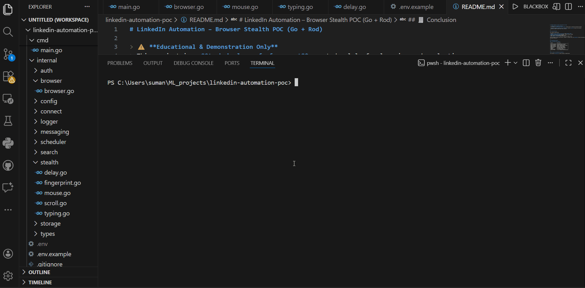

# LinkedIn Automation – Browser Stealth POC (Go + Rod)

> ⚠️ **Educational & Demonstration Only**
> This project is a **technical proof-of-concept** created solely for learning and evaluation purposes.
>
> **It does NOT automate LinkedIn actions in production** and must **never** be used on real accounts.
> Automating LinkedIn violates their Terms of Service.

---

## 📌 Project Overview

This repository demonstrates:

* Advanced **browser automation architecture** using **Golang + Rod**
* **Human-like interaction simulation** (mouse, typing, scrolling, timing)
* **Browser fingerprint masking** techniques
* Clean, modular, and maintainable Go code structure
* Safe **demo-only execution** without performing real LinkedIn actions

The tool launches a visible Chrome browser, navigates to LinkedIn login, and **simulates** realistic human behavior using dummy credentials.

---

## 🧠 Implemented Features

### ✅ Core Demonstration Features

| Feature            | Description                        |
| ------------------ | ---------------------------------- |
| Browser Automation | Chrome automation using Rod        |
| Visible Execution  | Non-headless mode for demo         |
| Human-like Mouse   | Smooth, randomized mouse movement  |
| Human-like Typing  | Variable keystroke delay           |
| Random Scrolling   | Natural scrolling behavior         |
| Random Delays      | Think time between actions         |
| Scheduler          | Time-window based execution        |
| Logging            | Structured CLI logs                |
| Config Handling    | `.env`-based configuration         |
| State-safe Demo    | No real LinkedIn actions performed |

---

### 🕵️ Stealth & Anti-Detection (Demo-Safe)

The following **non-abusive** stealth concepts are demonstrated:

* `navigator.webdriver` masking
* Random viewport size
* User-like mouse paths
* Typing rhythm variation
* Action cooldowns
* Randomized delays
* Execution window scheduling

> 🔒 These are **conceptual demonstrations**, not production bypasses.

---

## 📂 Project Structure

```
linkedin-automation-poc/
│
├── assets/                   # Demo GIFs / images
│   └── demo.gif
├── cmd/
│   └── main.go                # Application entry point
├── internal/
│   ├── auth/                  # Login demo logic
│   ├── browser/               # Browser & launcher setup
│   ├── config/                # Env config loader
│   ├── connect/               # Connection demo service
│   ├── messaging/             # Messaging demo service
│   ├── search/                # Profile search simulation
│   ├── scheduler/             # Time-window control
│   ├── stealth/               # Human behavior simulation
│   ├── storage/               # State placeholder
│   ├── types/                 # Domain models
│   └── logger/                # Structured logging
├── .env.example               # Environment template
├── go.mod
├── go.sum
└── README.md
```

---

## ⚙️ System Requirements

| Requirement | Version                   |
| ----------- | ------------------------- |
| Go          | **1.22+**                 |
| OS          | Windows / macOS / Linux   |
| Browser     | Google Chrome (installed) |

> ⚠️ On **Windows**, antivirus may block automation tools.
> This project disables Rod leakless mode safely.

---

## 🧩 Setup Instructions

### 1️⃣ Clone Repository

```bash
git clone https://github.com/sSumankumari/linkedin-automation-poc.git
cd linkedin-automation-poc
```

---

### 2️⃣ Create Environment File

Copy the example file:

```bash
cp .env.example .env
```

Edit `.env`:

```env
LINKEDIN_EMAIL=dummy@example.com
LINKEDIN_PASSWORD=dummy_password
HEADLESS=false
START_HOUR=0
END_HOUR=23
```

> ℹ️ **Dummy credentials only** — no real account required.

---

### 3️⃣ Install Dependencies

```bash
go mod tidy
```

---

### 4️⃣ Build Project

```bash
go build ./...
```

---

## ▶️ Running the Demo

```bash
go run ./cmd
```

---

## 🧪 What Happens During Execution

When you run the project:

1. Scheduler validates allowed time window
2. Chrome launches visibly
3. Viewport size is randomized
4. Browser fingerprint is masked
5. Mouse moves naturally
6. Page scrolls randomly
7. LinkedIn login page opens
8. Dummy credentials are typed using human-like typing
9. Search, connect, and messaging services **simulate behavior**
10. All steps are logged in CLI

---

## 🖼 Demo Preview (GIF)

A short animated preview showcasing browser launch, fingerprint masking, and human-like interaction simulation.

<p align="center">
  
</p>

---

## 🎥 Demo Video

A short walkthrough demonstrating browser execution, stealth configuration, and human-like interaction simulation.

👉 <a href="https://drive.google.com/file/d/1BM9rj2lN4AMshNVJzjcz-JgM-2DupGCl/view?usp=sharing" target="_blank" rel="noopener noreferrer">
Watch Demo Video </a>

---

## 🖥 Sample CLI Output

```text
PS C:\Users\suman\ML_projects\linkedin-automation-poc> go run ./cmd
{"level":"info","time":"2025-12-20T13:05:51+05:30","message":"LinkedIn Automation POC started"}
[DEMO] Scheduler check: current=13, allowed=0-23
[DEMO] Chrome launcher started
[DEMO] Connected to Chrome instance
[DEMO] Viewport randomized: 1263 x 749
[DEMO] Fingerprint masking applied
[DEMO] Human thinking delay: 837 ms
[DEMO] Human-like mouse movement
[DEMO] Scrolling page by 349px
{"level":"info","time":"2025-12-20T13:06:03+05:30","message":"[DEMO] Starting login simulation"}
[DEMO] Human thinking delay: 1136 ms
[DEMO] Human-like typing started
[DEMO] Human thinking delay: 760 ms
[DEMO] Human-like typing started
[DEMO] Typed dummy credentials using human typing
[DEMO] Human thinking delay: 1832 ms
[DEMO] Login button NOT clicked (ToS safe)
{"level":"info","time":"2025-12-20T13:06:18+05:30","message":"[DEMO] Login flow demonstrated successfully"}
{"level":"info","time":"2025-12-20T13:06:18+05:30","message":"[DEMO] Simulating LinkedIn search"}
[DEMO] Profiles parsed from DOM (simulated)
{"level":"info","profile":"https://linkedin.com/in/demo-profile-1","time":"2025-12-20T13:06:20+05:30","message":"Processing profile"}
[DEMO] Human thinking delay: 1472 ms
{"level":"info","profile":"https://linkedin.com/in/demo-profile-1","time":"2025-12-20T13:06:21+05:30","message":"[DEMO] Connection request simulated"}
[DEMO] Connect button NOT clicked (ToS safe)
{"level":"info","profile":"https://linkedin.com/in/demo-profile-2","time":"2025-12-20T13:06:24+05:30","message":"Processing profile"}
[DEMO] Human thinking delay: 1828 ms
{"level":"info","profile":"https://linkedin.com/in/demo-profile-2","time":"2025-12-20T13:06:26+05:30","message":"[DEMO] Connection request simulated"}
[DEMO] Connect button NOT clicked (ToS safe)
{"level":"info","time":"2025-12-20T13:06:29+05:30","message":"Demo execution completed successfully"}
```

---

## 🧾 Conclusion

This project demonstrates a **demo-only implementation** of browser automation concepts using Golang and Rod, focusing on:

* Human-like behavior simulation
* Stealth awareness
* Clean modular architecture

It is intentionally designed for **technical evaluation and learning**, showcasing how such systems are structured without performing real-world automation or violating platform policies.
